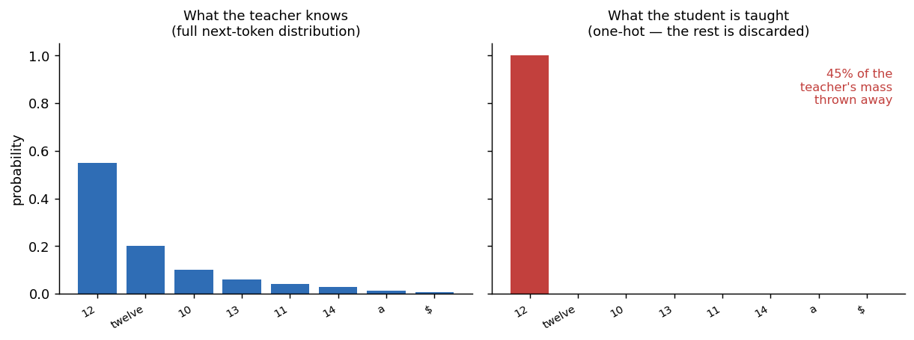
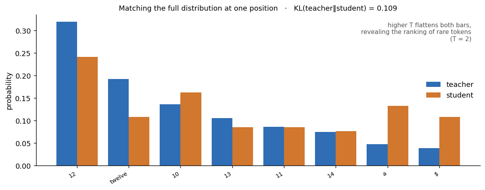
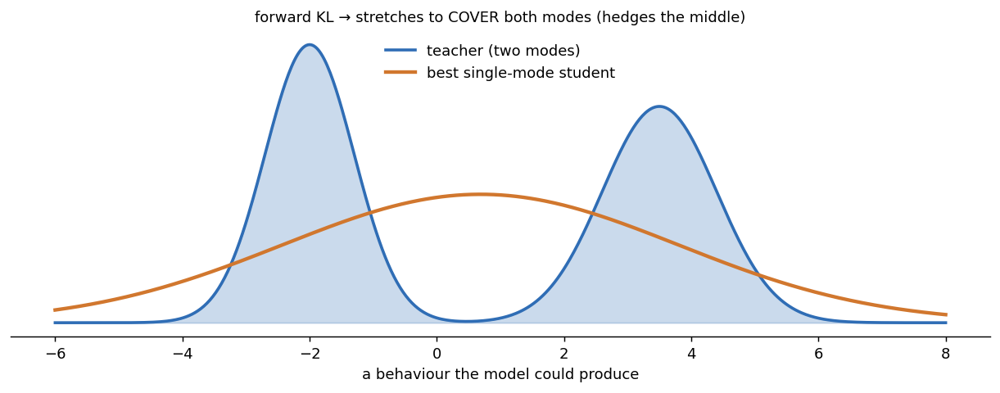
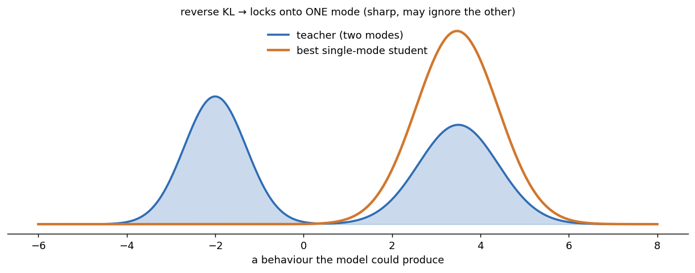
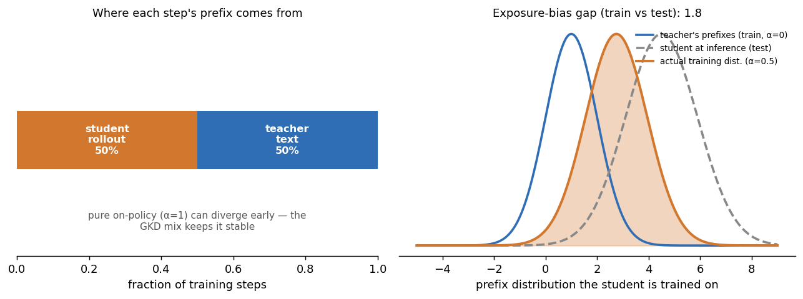
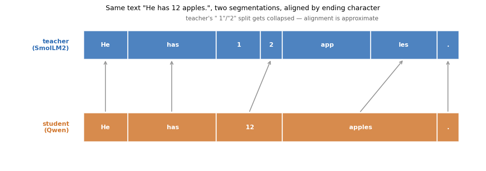
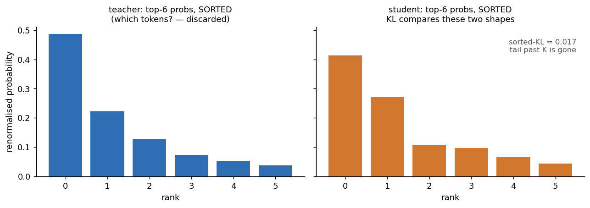
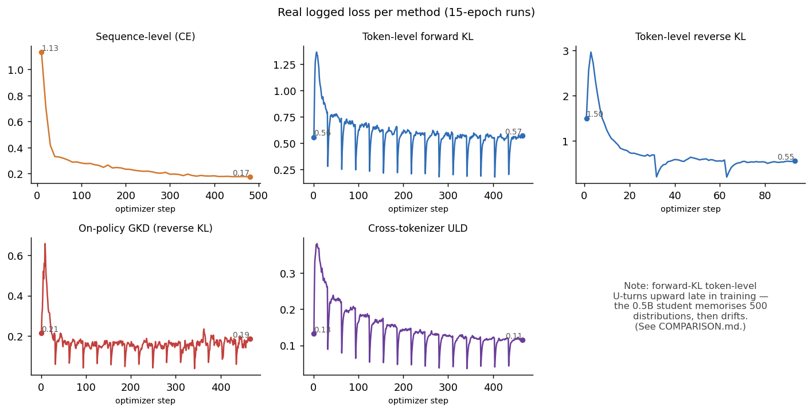

# Distillation: how does it work?

A runnable project that demonstrates LLM knowledge distillation: transferring the capability of a large "teacher" model into a much smaller "student" model.

I built this to see better understand what distillation is. It is easy to spend a lot of time reading about it and work with abstractions in your mind. It is much better to see and taste what distillation is.

I believe learning sediments better if I do it myself. Hence, this is a project coded by hand; Claude Opus 4.7 and Qwen 3.6 35b3a were my guides.

## Four distillation methods in this repo

The teacher generates step-by-step solutions to [GSM8K math problems](https://huggingface.co/datasets/openai/gsm8k). The student (Qwen2.5-0.5B) is then trained four different ways:

1. Sequence-level
2. Token-level / logit KL
3. On-policy / GKD
4. Cross-tokenizer / ULD

See [`COMPARISON.md`](./COMPARISON.md) for head-to-head GSM8K accuracy across
the four methods plus the un-tuned base student.

## Visualising the four methods

Each method below comes with a picture of its *mechanism* — what signal the
teacher has and how much of it the student actually receives. An interactive
[marimo](https://marimo.io) notebook lets you drive every figure with a slider
(teacher confidence, KL temperature, on-policy mix, top-K):

```bash
uv run marimo edit notebooks/distillation_viz.py     # interactive, with sliders
uv run marimo run  notebooks/distillation_viz.py     # read-only app
uv run python notebooks/export_figures.py            # regenerate the static PNGs below
```

Throughout: **<span title="teacher">blue = teacher / target</span>**,
**orange = student**, **red = signal the method keeps**,
**grey = signal thrown away**.

## Quickstart

```bash
# 1. Generate teacher solutions (one-off, ~5 min on a single GPU).
uv run python -m src.generate_teacher_data

# 2. Train any of the four students (LoRA adapters). EPOCHS is an env var.
EPOCHS=5 uv run python -m src.sequence_level_distillation
EPOCHS=5 uv run python -m src.token_level_distillation --kl forward  # or reverse
EPOCHS=5 uv run python -m src.on_policy
EPOCHS=5 uv run python -m src.cross_tokenizer

# 3. Evaluate any combination against held-out GSM8K test problems.
uv run python -m src.eval_gsm8k --n 100 --adapters base distilled_sequence_level \
    distilled_token_level distilled_student_onpolicy distilled_student_uld
```

Train one method at a time on this machine — running multiple in parallel
trips an NVML init race in `torch`'s caching-allocator warmup. On-policy is
~20–40× slower than the off-policy methods because every step generates from
the student.

The student is `Qwen2.5-0.5B` and the same-tokenizer teacher is
`Qwen2.5-3B-Instruct`; cross-tokenizer uses `SmolLM2-1.7B-Instruct` as a
different-vocab teacher. All hyperparameters are inline constants at the top
of each `src/*_distillation.py` / `src/on_policy.py` / `src/cross_tokenizer.py`.

## Method 1: Sequence-level distillation

The simplest approach. The teacher generates a completion for each prompt; the
student is fine-tuned with standard next-token cross-entropy on those completions.
We're treating the teacher's output text as ground truth and doing ordinary SFT.



The teacher's full next-token distribution (left) is collapsed to the single
argmax token (right). Everything else — including near-synonyms the teacher
rated highly — is discarded before the student ever sees it.

**Pros.** Works against any API (you only need to call generate). Cheap to
implement. No tokenizer constraints — the student can have a completely
different vocabulary from the teacher. This is how DeepSeek's R1-Distill
models were trained.

**Cons.** Throws away everything except the teacher's argmax at each token.
If the teacher was 60% sure about token X and 38% sure about a near-synonym Y,
the student is taught that Y is wrong. A lot of useful uncertainty signal is lost.

## Method 2: Token-level (logit) distillation

The direct LLM analog of Hinton's classical method. At every position in a
sequence, compute the KL divergence between the teacher's full next-token
distribution (over the whole vocabulary) and the student's. Loss is averaged
across positions where the assistant is talking (we mask out user prompt tokens).



Instead of one-hot, the student is pulled toward the teacher's *whole* shape.
Temperature softens both bars first, surfacing the teacher's ranking of the rare
tokens (its "dark knowledge").

**Pros.** The student receives a much denser training signal — instead of "the
right token is X," it learns "given this context, here's the full shape of
plausible continuations." Typically yields a noticeably stronger student than
sequence-level for the same data budget.

**Cons.** Requires white-box access to the teacher *and* matching tokenizers.
You can't do logit distillation from GPT-4 to Llama, for example — different
vocabularies, so the distributions live in non-comparable spaces. Memory cost
is also higher because you're keeping the teacher loaded and running forward
passes through it on every batch.

### Forward vs. reverse KL

`src/token_level_distillation.py` accepts a `--kl` flag with two options:

- **`--kl forward`** (default): minimizes `KL(teacher || student)`. This is
  *mode-covering* — the student is penalized for putting low probability where
  the teacher puts high probability. It tries to cover all of the teacher's
  behaviors, including unlikely ones. Can lead to a hedging, hallucination-prone
  student because it spreads its probability mass.

- **`--kl reverse`**: minimizes `KL(student || teacher)`. This is *mode-seeking*
  — the student is penalized only when *it* puts mass where the teacher doesn't.
  Result: the student concentrates on a high-probability subset of the teacher's
  behavior. The MiniLLM paper (Gu et al. 2024) showed this produces more focused,
  less hallucinatory students.

Fitting a single-mode student to a two-mode teacher makes the difference vivid —
forward KL stretches to cover both modes (and hedges the empty middle); reverse
KL commits to one mode and stays sharp:

| forward `KL(teacher‖student)` — mode-covering | reverse `KL(student‖teacher)` — mode-seeking |
| --- | --- |
|  |  |

Most modern LLM distillation uses reverse KL or a hybrid. Our on-policy script
uses reverse KL by default, following GKD.

## Method 3: On-policy distillation

Sequence-level and token-level both train the student on prefixes the *teacher*
generated. At inference time the student generates its own (messier) prefixes
— and has never been trained to recover from its own mistakes. This is exposure
bias, the classic train/test distribution mismatch.

On-policy distillation flips the data source: the student generates a
continuation from a prompt, the teacher scores its full next-token distribution
at every position of that continuation, and the student is trained to match the
teacher *given the student's own prefixes*. Think of it as a coach correcting
the student's mistakes in real time, rather than demonstrating perfect technique
from the sidelines.

We follow GKD (Generalized Knowledge Distillation, Agarwal et al. 2024): mix
on-policy steps with off-policy steps (using the teacher's pre-generated text)
for stability. Pure on-policy is unstable early because the student's
generations are gibberish — there's nothing useful for the teacher to score.
Loss is reverse KL with T=1, following MiniLLM/GKD.



Left: each step's prefix is either a fresh student rollout or pre-generated
teacher text (the GKD mix). Right: off-policy training (α=0) optimises the
student on the teacher's prefix distribution — but at inference the student
generates its own (the dashed curve). As α rises, the training distribution
slides onto the test distribution and the gap shrinks.

**Pros.** Closes the train/test gap. The student is explicitly trained on the
distribution it will actually see at inference, including its own
characteristic mistakes. Tends to produce more robust students than off-policy
methods at the same data budget.

**Cons.** The slowest method by far — every on-policy step requires a full
sampling pass through the student before the forward/backward. Still needs
white-box teacher access and matching tokenizers. Hyperparameter-sensitive:
the on-policy / off-policy mix matters, and pure on-policy can diverge early.

## Method 4: Cross-tokenizer distillation (ULD)

Token-level distillation breaks the moment teacher and student have different
vocabularies — their next-token distributions live in non-comparable spaces and
the KL is undefined. That rules out distilling, say, Llama → Qwen, which is
exactly the regime you care about if you want to combine the best open teacher
with whatever student architecture suits you.

ULD (Universal Logit Distillation, Boizard et al. 2024) sidesteps the vocab
mismatch with two tricks:

1. **Positional alignment via character offsets.** Both tokenizers expose the
   character span each token covers in the source text. For every student
   response token, we pick the teacher token whose ending character is closest.
   Same text, different segmentation, aligned by where the boundaries land.
2. **Sorted top-K matching.** At each aligned position, take the top-K
   probabilities from teacher and student, *sort* them, and compute KL between
   the two K-length vectors. Token identity is thrown away; only the shape of
   the distribution is matched. That shape lives in a vocab-independent
   K-dimensional space, so the comparison is well-defined.



Step 1 — the same response text segmented two different ways, aligned by which
character each token *ends* on. The teacher's `" 1"`/`"2"` split has no clean
student counterpart, so the match is approximate.



Step 2 — at each aligned position, sort each side's top-K probabilities and
compare the two *shapes*. Token identity is thrown away, so the comparison lives
in a vocab-independent K-dimensional space (and the tail past K is gone).

This repo distills `SmolLM2-1.7B-Instruct` (teacher) → `Qwen2.5-0.5B`
(student) — two completely different tokenizers.

**Pros.** The only method here that works across model families. Lets you
pick teacher and student independently — useful when the best available
teacher and the architecture you want to deploy come from different ecosystems.

**Cons.** Lossy on multiple axes: character-offset alignment is approximate
(it can skew badly when one tokenizer splits a word the other keeps whole),
sorted top-K matching discards which tokens the probabilities belong to, and
the top-K cutoff truncates the tail entirely. Expect a noticeably weaker
student than same-tokenizer token-level distillation on the same data. Also
the most fiddly of the four to implement correctly — most of the code is
alignment bookkeeping, not the loss itself.

## The real training curves

The pictures above are cartoons of each *mechanism*. Below are the actual loss
trajectories logged during the 15-epoch runs (`src/logger.py` → `logs/`).
Magnitudes aren't comparable across panels — different losses, temperatures and
scales — only the shape *within* a panel is meaningful. Note token-level forward
KL bottoming out mid-run and climbing back up: the 0.5B student memorises 500
teacher distributions, then drifts (the overfitting story in `COMPARISON.md`).



## Looking inside the distilled students (TransformerLens)

The accuracy numbers tell you *which* method won; they don't tell you *what
changed inside the model*. Since every `distilled_*` folder is a LoRA adapter
that only edits the attention projections, we can merge each adapter back into
Qwen2.5-0.5B, load it into [TransformerLens](https://github.com/TransformerLensOrg/TransformerLens),
and watch the mechanism directly.

```bash
# Static figures for all five students (base + four methods) -> figures/
uv run python -m src.visualize

# Or explore interactively (hover-able attention via circuitsvis, logit lens, ...)
uv run jupyter lab explore_distilled_models.ipynb
```

- `src/interp.py` — `load_hooked(adapter)` merges a LoRA adapter and returns a
  `HookedTransformer`; pass `None` for the un-tuned base student.
- `src/visualize.py` — writes four figures to `figures/`.
- `explore_distilled_models.ipynb` — the same techniques, interactively.

Four things to look at:

1. **Logit lens** (`figures/logit_lens.png`) — reading the residual stream
   through the unembedding at each layer shows the correct answer only
   crystallises in the last ~3 of 24 layers, and the methods differ in exactly
   where and how steeply.
2. **Attention grid** (`figures/attention_grid.png`) — every head at one layer,
   the usual cast on display: current-token, previous-token, and a first-token
   attention sink.
3. **Attention diff** (`figures/attention_diff.png`) — base vs distilled on the
   single most-changed head. Because LoRA only touches attention, this *is* the
   change distillation made, isolated.
4. **Token shift** (`figures/token_shift.png`) — at the answer position the base
   student starts by parroting the subject (`Sarah`); distillation teaches it to
   open with a reasoning preamble (`To`, `Let`, `First`, …). The weak ULD student
   shows a much smaller shift, mirroring its low accuracy.
